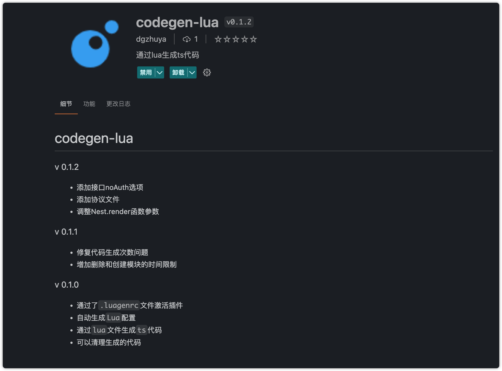
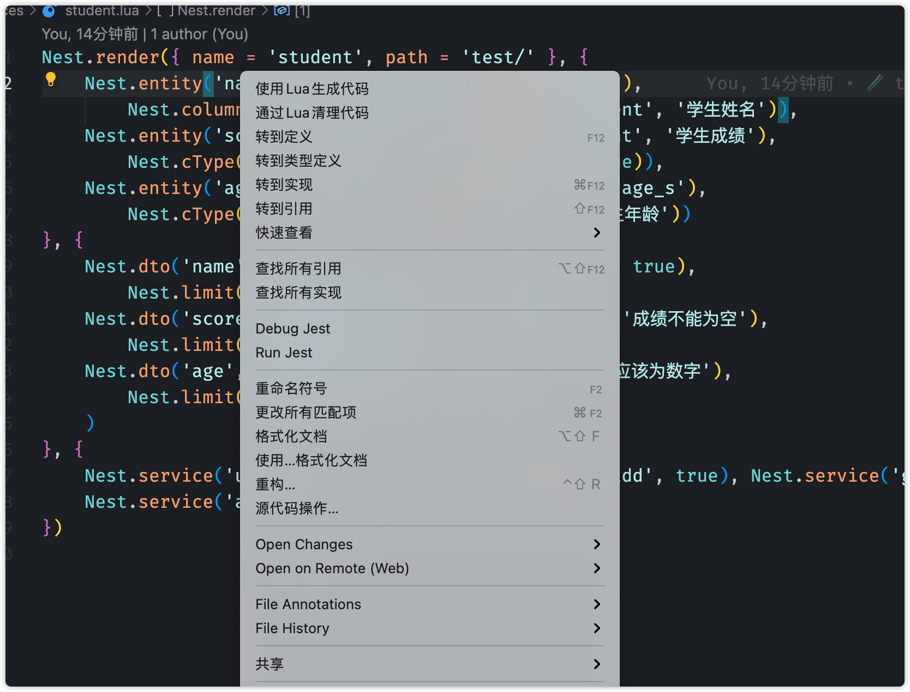
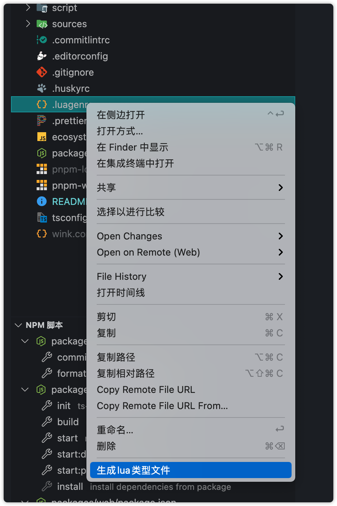

# wink-vue-admin

> 这是一个使用 vue3+ts+nestjs 开发的后台管理系统,可通过`vscode`下`codegen-lua`插件使用`lua`快速生成代码

### 代码生成
- 安装插件
	vscode插件中心搜索`codegen-lua`安装即可
	
- 生成代码
  - 修改`.luggenrc`文件设置文件生成目录
    - [x] `apiDir`: 后端模块根目录
    - [x] `webdDir`: 前端模块根目录
    - [x] `sqliteFile`: 设置数据库文件位置 
  - 打开`sources/student.lua`文件，点击右键即可
     
  - 点击`生成代码`即可查看已生成的代码(位于`packages/api/src`目录下),同时修改`packages/api/src/app.module.ts`自动导入生成的模块
  - 点击`清理代码`即可将已生成的代码清理完成
  - 修改`lua`文件
    - 鼠标放置到`.luggenrc`文件上,右键点击即可出现生成`lua`类型文件选项，点击即可生成类型文件到`.vscode`目录下
      
    - `.vscode`目录下生成了三个文件
      - [x] `nest-type.lua:`记录了后端生成代码的`lua`函数,通过阅读即可知道各个函数和参数还有返回值信息
      - [x] `base-type.lua`: 实现了基础函数,比如打印
      - [x] `vue-type.lua:`: 生成前端代码


### 项目启动

> 本项目使用pnpm管理,请提前安装 [pnpm](https://pnpm.io/)

- 项目依赖

  ```sh
  pnpm i
  ```
- 初始化数据库
  
  进入`packages/api`目录下运行
  ```sh
  pnpm run init
  ```
- 运行后端: 进入`packages/api`目录，运行
  ```sh
  pnpm run start
  ```
- 运行前端: 进入`packages/web`目录，运行
  ```sh
  pnpm run dev
  ```
- 默认信息
  - 用户名: `super-admin`
  - 密码: `123456`
